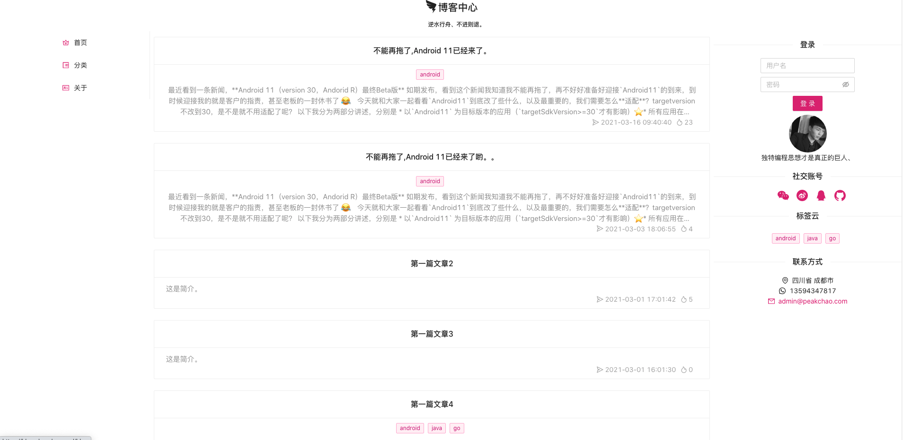
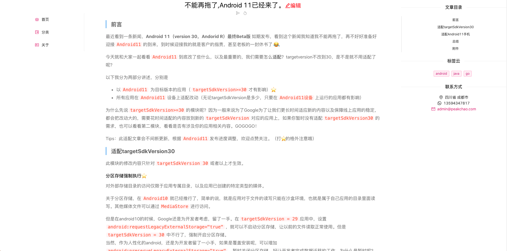
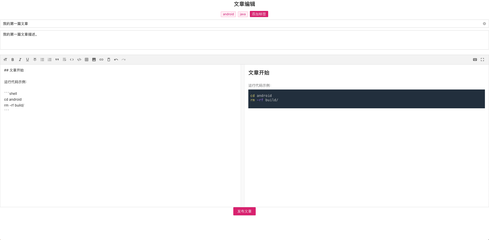

# 项目演示地址：[https://bloger.peakchao.com](https://bloger.peakchao.com)

# 由于考虑到国内网络问题，在此提供镜像地址

[gitee](https://gitee.com/peakchao/react-blog.git)
[github](https://github.com/zhangzhichaolove/react-blog.git)

# 项目截图





# 极速体验

> github用户 点击[releases](https://github.com/zhangzhichaolove/react-blog/releases)，下载对应平台文件解压后直接运行，然后浏览器访问[http://localhost](http://localhost)即可。

> gitee用户 点击[releases](https://gitee.com/peakchao/react-blog/releases)，下载对应平台文件解压后直接运行，然后浏览器访问[http://localhost](http://localhost)即可。
# React-Blog 使用说明

## 后端服务

> 注意：本博客采用前后端分离方式开发，故此博客运行需要启动后端服务进行辅助，后端服务请在Releases下载。
> 启动服务前，你需要配置一些参数，请在server同级目录创建文件`config/application.yml`,并将如下内容添加。

```
running:
  mode: debug

server:
  port: 80
  https: false

error:
  # zh/en
  language: zh

datasource:
  driverName: sqlite3
  host: localhost
  port: 3306
  database: test
  username: root
  password:
  charset: utf8
  maxOpenConns: 0
  maxIdleConns: 20
  local: Asia/ShangHai

qiniu:
  accessKey: XXXX
  secretKey: XXXXXXX
  bucket: peakchao
  url: http://res.chaochao.cool/
```

> 目录结构

```
blog_api
├── config
│   └── application.yml
```

> 启动服务

```
# windows
./blog_api.exe
# mac and linux
./blog_api
```

> 如果不需要服务在后台运行，请在启动时候添加如下参数。

```
./blog_api -d=false
```

> 如果你已经后台运行了服务，此时需要停止后台运行请使用如下命令。

```
./blog_api stop
```

## 快速开始

> 克隆项目源码

```
git clone https://github.com/zhangzhichaolove/react-blog.git
```

> 安装项目依赖

```
cd react-blog
npm install
```

> 运行项目

```
npm start
```

> 浏览器访问[http://localhost:3000](http://localhost:3000)

## 上线部署

> 确认域名地址是否配置完毕，[配置地址](https://github.com/zhangzhichaolove/react-blog/blob/main/src/util/AxiosUtil.ts),然后执行如下命令进行编译。

```
npm run build
```

> 编译完成后将会得到build目录，将build目录重命名为blog并放到后端服务同级目录，后台启动后端服务即完成部署。

> 目录结构

```
blog_api
├── blog
├── config
│   └── application.yml
```


## 欢迎大家加入开发，一起完善功能。
## QQ讨论群:一群 `712912397`  二群 `632512781`
